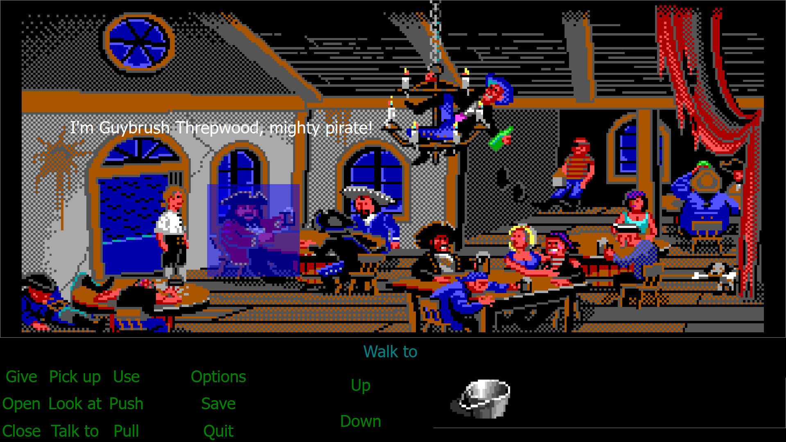

# PyQtSCUMM

This is a quick and dirty prototype of a 2D adventure game interface using PyQt6. I completed an online tutorial and thought of this for a training project. PyQT itself is not the best choice for Python Game vs native app but was just experimenting with it one weekend out of interest with its common use to build tools for art pipleines, etc.

# Example Scene

